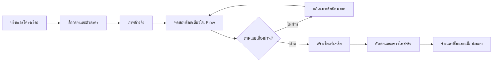

# Chinese Short Film × Google Flow

ชุดเวิร์กโฟลว์ภาษาไทยสำหรับสร้างหนังสั้นจีนแนวตั้งด้วย **ChatGPT หรือ Claude + Google Flow** ตั้งแต่คิดเรื่อง ล็อกตัวละคร เขียนบท สร้างภาพอ้างอิง เจนทีละช็อต ตรวจเสียง ไปจนถึงเตรียมไฟล์เผยแพร่

ถอดบทเรียนจาก [ChatGPT × Google Flow ทำหนังสั้นจีนแนวตั้ง! — BoomBigNose](https://youtu.be/7ZbYX93n4GY) และเพิ่มแนวทางใช้งานกับ Claude ตัวอย่างใน repo เป็นเรื่องแต่งใหม่ ไม่ใช่บทหรือไฟล์ต้นฉบับของคลิป

**นี่คือ prompt/workflow repository** ใช้ได้โดยไม่ติดตั้งโปรแกรมและไม่ต้องใส่ API key ไม่มีระบบเจนหนังหรือโพสต์อัตโนมัติที่ติดตั้งเสร็จแล้วใน repo

## เริ่มใช้ใน 5 นาที

1. ดาวน์โหลด repo ด้วย **Code → Download ZIP** แล้วแตกไฟล์ หรือ clone:

   ```sh
   git clone https://github.com/boombignose/chinese-short-film-flow.git
   cd chinese-short-film-flow
   ```

2. สร้าง Project ใหม่ใน ChatGPT หรือ Claude สำหรับหนังเรื่องนี้
3. คัดลอก [MASTER-PROMPT.md](prompts/MASTER-PROMPT.md) ไปเป็นคำสั่งโปรเจกต์ หรือวางเป็นข้อความแรกของแชต
4. แนบ [WORKFLOW.md](WORKFLOW.md), [แบบกรอกบรีฟ](templates/PRODUCTION.md) และ [ตัวอย่างครบ 6 ช็อต](examples/jade-seal-48s.md) ใช้ข้อความเริ่มงานด้านล่าง
5. นำภาพและพรอมป์ต์ที่อนุมัติแล้วไปสร้างใน [Google Flow](https://labs.google/fx/tools/flow) ตาม [คู่มือ Google Flow](docs/GOOGLE-FLOW.md)

```text
ใช้เวิร์กโฟลว์ในไฟล์ที่แนบ ช่วยสร้างหนังจีนย้อนยุคแนวตั้ง 9:16
ความยาวตัดต่อเป้าหมาย 48 วินาที 6 ช็อต ตัวละครหลักผู้ใหญ่ 2 คน
บทพูดภาษาไทย อารมณ์ลึกลับโรแมนติก หักมุมท้ายตอน
เริ่มจากเสนอเรื่อง 3 แบบ จากนั้นพัฒนาแบบที่ฉันเลือก
ส่งบรีฟ character bible บท storyboard และพรอมป์ต์ Google Flow แยกช็อต
ทำเอกสารและพรอมป์ต์ก่อน ยังไม่กดสร้างสื่อหรือเผยแพร่
```

## เลือกวิธีใช้

| วิธี | ทำอะไรได้ | อ่านต่อ |
|---|---|---|
| ChatGPT Project / แชตทั่วไป | คิดบทและพรอมป์ต์; การสร้างภาพขึ้นกับเครื่องมือในบัญชี | [ChatGPT](docs/CHATGPT.md) |
| Claude Project / แชตทั่วไป | คิดบท ตรวจความต่อเนื่อง จัดชุดพรอมป์ต์; ใช้ Flow สร้างภาพและวิดีโอ | [Claude](docs/CLAUDE.md) |
| Agent ที่มี browser/computer tools | อาจดำเนินการใน Flow ได้ เมื่อมีเครื่องมือและสิทธิ์จริง | [คำสั่งดำเนินงาน](prompts/OPERATOR.md) |

การวาง prompt หรือเชื่อม repo ไม่ได้ทำให้ AI ควบคุมคอมพิวเตอร์ได้โดยอัตโนมัติ ถ้าไม่มีเครื่องมือ ให้ทำตามขั้นตอนแบบคัดลอกไปวางใน Flow

## เส้นทางผลิต



## ไฟล์ที่ใช้จริง

- [วิเคราะห์คลิปพร้อมเวลา](docs/VIDEO-ANALYSIS.md): สิ่งที่พบ หลักฐาน และสิ่งที่นำมาต่อยอด
- [WORKFLOW.md](WORKFLOW.md): ขั้นตอนผลิตและเกณฑ์ผ่าน
- [MASTER-PROMPT.md](prompts/MASTER-PROMPT.md): ผู้ช่วยผู้กำกับ ใช้ร่วมกันได้ทั้งสองระบบ
- [OPERATOR.md](prompts/OPERATOR.md): คำสั่งสำหรับ agent ที่มีเครื่องมือทำงานจริง
- [REPAIR.md](prompts/REPAIR.md): แก้หน้าตาเปลี่ยน เสียงผิดคน บทพูดหลุด และเจนล้มเหลว
- [PRODUCTION.md](templates/PRODUCTION.md): บรีฟ บท และบันทึกช็อตในไฟล์เดียว
- [ตัวอย่างตราหยกใต้โคมแดง](examples/jade-seal-48s.md): บทภาษาไทย ภาพอ้างอิง และพรอมป์ต์ครบ 6 ช็อต
- [AGENTS.md](AGENTS.md) / [CLAUDE.md](CLAUDE.md): คำสั่งสำหรับโปรแกรม agent ที่รองรับไฟล์เหล่านี้
- [Skill แบบเลือกใช้](.agents/skills/chinese-short-film/SKILL.md): ต้องติดตั้งตามวิธีของโปรแกรม ไม่ได้ติดตั้งให้เอง

## ขอบเขตและสถานะ

- ตรวจคำบรรยายอัตโนมัติทั้งคลิป คำอธิบาย และภาพตัวอย่างที่ 04:55, 08:10, 09:40, 11:06 แล้ว
- คู่มือผลิตภัณฑ์ตรวจวันที่ **21 กันยายน 2026** ชื่อเมนู รุ่นโมเดล ระยะเวลา และเครดิตอาจเปลี่ยนได้
- ตัวอย่าง 48 วินาทีเป็น **production plan** ยังไม่ได้สร้างภาพ วิดีโอ หรือทดสอบการเจนจริงใน ChatGPT, Claude และ Flow
- การเจนใช้เครดิตตามบัญชี Google; ตรวจยอดก่อนทำงาน ระยะเวลาช็อตในแผนไม่ใช่การรับประกันผลลัพธ์
- จัดทำต้นฉบับและไฟล์ส่งมอบก่อน การโพสต์ต้องมีคำสั่งระบุบัญชี แพลตฟอร์ม และเนื้อหาที่จะเผยแพร่

เอกสารและตัวอย่างที่เขียนใหม่ใน repo ใช้ [MIT License](LICENSE) ลิงก์คลิป ชื่อผลิตภัณฑ์ และสื่อของบุคคลอื่นยังเป็นของเจ้าของเดิม ไม่มีไฟล์วิดีโอต้นฉบับหรือข้อมูลเข้าสู่ระบบรวมอยู่ด้วย
